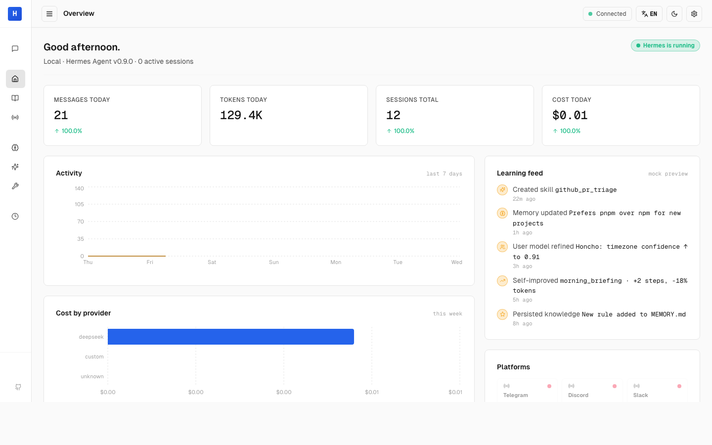

# Hermes Dashboard

> A third-party, animation-driven web dashboard for [Hermes Agent](https://github.com/NousResearch/hermes-agent) — real-time chat, deep observability, and a terminal-luxury aesthetic.

[](./LICENSE)
[](https://nodejs.org/)
[](https://github.com/NousResearch/hermes-agent)
[](#development)
[](#performance)

**🌐 Languages** · **English** · [简体中文](./README.zh-CN.md)



---

## Overview

**Hermes Dashboard** is a standalone, polished web frontend for a locally running Hermes Agent. It is explicitly **not affiliated with Nous Research or the Hermes Agent team** — this is an independent, MIT-licensed project that talks to Hermes over its public HTTP APIs, with zero modifications to the agent itself required.

What you get out of the box:

- **Real-time chat** with your Hermes agent (streaming SSE, multi-turn continuation, full tool/skill/memory access)
- **Nine pages** covering every operational surface: Overview, Chat, Sessions, Platforms, Memory & You, Skills, Tools & MCP, Schedules & Costs, Settings
- **Dark / Light theme** with full EN / ZH bilingual UI
- **Zero CDN dependency** — fonts, icons, assets all bundled; works on air-gapped networks
- **Instant language / theme switching**, persisted across reloads
- **Reduced-motion aware** — every keyframe animation collapses under `prefers-reduced-motion: reduce`

The design bar is set by **Linear**, **Vercel Dashboard**, and **Raycast** — information-dense but composed, with motion that always carries meaning.

---

## Table of contents

- [Screenshots](#screenshots)
- [Why another dashboard?](#why-another-dashboard)
- [Architecture](#architecture)
- [Prerequisites](#prerequisites)
- [Install & run](#install--run)
- [Configuration](#configuration)
- [Compatibility](#compatibility)
- [Tech stack](#tech-stack)
- [Development](#development)
- [Performance](#performance)
- [Known limitations](#known-limitations)
- [Contributing](#contributing)
- [License](#license)
- [Acknowledgements](#acknowledgements)

---

## Screenshots

The banner above shows the **Overview** page in light mode. The dashboard has nine pages in total — each one is best experienced live:

| Page                 | What you see there                                                |
| -------------------- | ----------------------------------------------------------------- |
| **Overview**         | Agent vitals, 7-day activity chart, cost-by-provider, learning feed |
| **Chat**             | Real-time streaming conversation with your Hermes agent            |
| **Sessions**         | Split-pane browser of every agent run with full message detail    |
| **Platforms**        | Messaging-gateway connection status (Telegram / Discord / Slack …) |
| **Memory & You**     | What Hermes remembers, infers, and how it speaks                  |
| **Skills**           | Full catalogue of procedural memory, searchable by category        |
| **Tools & MCP**      | Built-in tools and Model Context Protocol servers                  |
| **Schedules & Costs** | Cron jobs and daily / weekly / monthly spend                       |
| **Settings**         | Theme, language, Hermes API URL, configuration viewer              |

> To keep the repository lightweight, we ship only the hero screenshot. Run `npm run dev` to see every page live, or regenerate any of them yourself with the script in [`docs/screenshots/README.md`](./docs/screenshots/README.md). URL query parameters `?theme=light|dark` and `?lang=en|zh` let you jump straight to any combination.

---

## Why another dashboard?

| Project                         | Maintainer                      | Focus                                                  | Trade-off                                        |
| ------------------------------- | ------------------------------- | ------------------------------------------------------ | ------------------------------------------------ |
| Official Dashboard (v0.9.0)     | Nous Research                   | React 19 + shadcn/ui; feature-complete                 | Restrained visuals; no ambient motion            |
| hermes-workspace                | outsourc-e                      | 8 themes, PWA, chat + terminal                         | Heavy; depends on a forked Hermes                |
| hermes-webui                    | nesquena                        | Vanilla JS, zero build                                 | Chat-first; not an admin panel                   |
| mission-control                 | community                       | Multi-agent fleet management                           | Not single-instance                              |
| **Hermes Dashboard (this one)** | Hermes Dashboard contributors   | Single-instance with real chat + deep observability    | Narrow scope by design                           |

**What's unique here:** the chat page actually **converses with your Hermes agent** (through Hermes' built-in OpenAI-compatible adapter), not a stubbed LLM. Your agent's tools, skills, and memory are all active.

---

## Architecture

```
┌──────────────────────────────────┐              ┌─────────────────────────────────────┐
│  Browser                         │              │  Hermes Agent (your machine)        │
│  ┌────────────────────────────┐  │              │                                     │
│  │ Hermes Dashboard           │  │   GET /api   │  :9119  FastAPI (dashboard API)     │
│  │ http://localhost:5173      │──┼──────────────┼─►   /api/status   (public)          │
│  │                            │  │              │     /api/sessions                   │
│  │ React 19 + Vite 6          │  │              │     /api/env · /api/config          │
│  │ Tailwind v4 + Geist fonts  │  │              │     /api/skills · /api/logs         │
│  │                            │  │   POST /v1   │                                     │
│  │                            │──┼──────────────┼─►   :8642  aiohttp (chat API)       │
│  └────────────────────────────┘  │   SSE chat   │     /v1/chat/completions            │
│                                  │              │     /v1/runs · /v1/models           │
└──────────────────────────────────┘              │                                     │
                                                  │  Agent loop invokes your            │
                                                  │  configured provider (OpenAI,       │
                                                  │  DeepSeek, Anthropic, etc.)         │
                                                  └─────────────────────────────────────┘
```

The dashboard is pure client-side (no backend of its own). Vite's dev proxy forwards `/api/*` and `/v1/*` to the local Hermes ports, eliminating CORS for browser requests and keeping authentication tokens same-origin.

---

## Prerequisites

1. **Node.js 20 or newer** (Node 22 recommended; CI runs on Node 22 Alpine).
2. **Hermes Agent v0.9.0** installed locally — follow the [official installer](https://github.com/NousResearch/hermes-agent#installation).
3. **At least one LLM provider API key** configured on the Hermes side (e.g. `OPENAI_API_KEY`, `DEEPSEEK_API_KEY`, `ANTHROPIC_API_KEY`, `GLM_API_KEY`). The dashboard itself never sees or stores this key — Hermes does all LLM calls.

---

## Install & run

### Step 1 — Enable Hermes' built-in chat API

Hermes ships an **OpenAI-compatible HTTP adapter** on port **8642** (see `gateway/platforms/api_server.py`). It is disabled by default. Enable it by appending to `~/.hermes/.env`:

```bash
# Enable the OpenAI-compatible chat API (required for Chat page)
API_SERVER_ENABLED=true
API_SERVER_HOST=127.0.0.1
API_SERVER_PORT=8642
API_SERVER_ALLOW_ALL_USERS=true
API_SERVER_CORS_ORIGINS=http://localhost:5173,http://localhost:3000

# Set an API key so Dashboard can continue existing sessions (X-Hermes-Session-Id)
API_SERVER_KEY=dashboard-local-$(openssl rand -hex 8)
```

Copy the generated `API_SERVER_KEY` value — you'll paste it into the dashboard's `public/runtime-config.js` below.

Then start (or restart) the Hermes messaging gateway:

```bash
hermes gateway run    # foreground, logs to stderr
# or: hermes gateway start    # background as launchd/systemd service
```

Verify the chat API is up:

```bash
curl http://127.0.0.1:8642/health
# => {"status": "ok", "platform": "hermes-agent"}
```

### Step 2 — Clone & install the dashboard

```bash
git clone https://github.com/<your-fork>/hermes-dashboard.git
cd hermes-dashboard
npm install --legacy-peer-deps
```

> The `--legacy-peer-deps` flag is needed because `recharts@2` still lists `react@^16||^17||^18` in its peer-dep declaration; it works fine at runtime with React 19.

### Step 3 — Wire the chat API key

Edit `public/runtime-config.js` and paste the `API_SERVER_KEY` you set in step 1:

```js
window.__HERMES_RUNTIME_CONFIG__ = {
  API_URL: '',
  CHAT_API_KEY: 'dashboard-local-XXXXXXXXXXXXXXXX',  // ← paste here
};
```

### Step 4 — Run

```bash
npm run dev
# ➜ Local:   http://localhost:5173
```

Open the URL, click **Chat** in the sidebar, and type. You should see a streaming response from your configured model.

### Docker (production)

```bash
docker build -t hermes-dashboard .
docker run --rm -p 3000:80 \
  -e API_URL=http://host.docker.internal:9119 \
  -e CHAT_API_KEY=dashboard-local-XXXXXXXXXXXXXXXX \
  hermes-dashboard
# Open http://localhost:3000
```

On container start, the entrypoint writes `runtime-config.js` with the runtime values, and the SPA picks them up on load.

---

## Configuration

| Surface             | Mechanism                                                                                           |
| ------------------- | --------------------------------------------------------------------------------------------------- |
| Dashboard API URL   | Settings → Connection; falls back to runtime config, then `VITE_HERMES_API_URL`, then same-origin   |
| Chat API key        | `public/runtime-config.js` `CHAT_API_KEY` (dev) or `CHAT_API_KEY` env var (Docker)                  |
| Theme               | Top-right sun / moon toggle; persisted in `localStorage`                                            |
| Language            | Top-right EN / ZH toggle; persisted                                                                 |
| Session token       | Auto-extracted from Hermes SPA shell via Vite's `/__hermes_bootstrap` proxy; manual fallback in Settings |

Priority (highest wins): **Settings persistence > runtime config > build-time env var > defaults**.

Changing the base URL clears all React-Query caches and forces a token re-fetch.

---

## Compatibility

| Hermes Dashboard | Hermes Agent | Notes                                                                            |
| ---------------- | ------------ | -------------------------------------------------------------------------------- |
| 0.2.x            | **0.9.0**    | Verified against `/api/status`, `/api/sessions`, `/api/config`, `/api/env`, `/api/skills`, `/api/logs`, and the `/v1/*` chat adapter. |

Older Hermes versions are untested. Newer versions should work so long as the API contract in `docs/api-audit.md` holds; a contract mismatch surfaces as a bilingual error toast instead of a silent failure.

---

## Tech stack

**Framework** · React 19 · TypeScript 5.6 · Vite 6

**Styling** · Tailwind CSS v4 · CSS custom properties · `@fontsource/geist-sans` + `@fontsource/geist-mono`

**State** · Zustand 5 (with `persist`) · TanStack Query v5

**Routing** · React Router v7 (lazy routes)

**Charts** · Recharts 2

**Icons** · Lucide React

**Testing** · Vitest + `@testing-library/react` + happy-dom

**Linting** · ESLint flat config with `typescript-eslint`, `eslint-plugin-jsx-a11y`, `eslint-plugin-react-hooks`

**Bundle budget** · `size-limit` with `@size-limit/preset-app`

---

## Development

```bash
npm run dev       # Vite dev server on :5173
npm run build     # Production build to dist/
npm run preview   # Serve the built dist/
npm run lint      # ESLint (zero warnings allowed)
npm run test      # Vitest in watch mode
npm test -- --run # One-shot test run
npm run size      # size-limit gate (critical <120KB gz)
```

All five CI gates must pass green before any merge:

- **lint** (0 errors, 0 warnings)
- **tsc -b --noEmit** (zero type errors)
- **test** (currently 90 tests across 14 files)
- **build** (Vite production build)
- **size-limit** (critical path ≤120KB gz, CSS ≤15KB gz)

See [`CONTRIBUTING.md`](./CONTRIBUTING.md) for coding conventions (no `any`, no `setInterval`, no `dangerouslySetInnerHTML`, every user-visible string must be bilingual, motion must respect the budget).

---

## Performance

| Metric                        | Budget       | Current   |
| ----------------------------- | ------------ | --------- |
| JS critical path (gzipped)    | < 120 KB     | ~107 KB   |
| CSS (gzipped)                 | < 15 KB      | ~8 KB     |
| Total JS including lazy chunks | < 260 KB     | ~244 KB   |
| Concurrent loop animations    | ≤ 5          | 3-4       |
| `will-change` usages          | ≤ 10         | 6         |

Animations are strictly limited to `opacity` and `transform` (GPU compositor only — no layout / paint thrash). `@media (prefers-reduced-motion: reduce)` collapses every animation and transition to 0.01 ms.

---

## Known limitations

The dashboard is constrained by what Hermes Agent v0.9.0 actually exposes:

1. **Skills enable/disable is read-only** in v0.1.x. `/api/skills/toggle` exists in v0.9.0 but wiring is deferred to v0.3.x.
2. **Cron CRUD is read-only** via `config.cron` snapshot. A full `/api/cron/jobs` CRUD exists in v0.9.0 but wiring is deferred.
3. **Gateway control buttons** (reconnect / restart) are absent — `/api/status.gateway_platforms` is read-only.
4. **Logs use 2-second polling**, not WebSocket. `/ws` returns 403 in v0.9.0.
5. **Overview "messages today"** aggregates the latest 20 sessions whose `started_at` falls on the current local day. No today-scoped endpoint exists yet.
6. **Configuration editor** is a JSON textarea, not a field-by-field form (write goes through a confirmation dialog).
7. **Model picker** in Chat is informational — the 8642 adapter only speaks `hermes-agent` as its model id; the actual model is whatever is set server-side (`config.model`).

See [`CHANGELOG.md`](./CHANGELOG.md) and [`docs/hermes-dashboard-dev-checklist.md`](./docs/hermes-dashboard-dev-checklist.md) for the full deferred-item list.

---

## Contributing

Bug reports, PRs, and UX feedback are welcome.

Before sending a PR, please run:

```bash
npm run lint && npx tsc -b --noEmit && npm test -- --run && npm run build && npm run size
```

All five must exit green. See [`CONTRIBUTING.md`](./CONTRIBUTING.md) for setup, code style, and the Design Token / animation budget rules.

Good first PRs:

- Translate any untranslated strings to a new language (scan `src/` for `useT()` calls that pass only English)
- Add screenshots to `docs/screenshots/` for any missing pages (Memory, Tools, Settings)
- File a bug report with repro steps when a page misrenders against a Hermes version newer than 0.9.0

---

## License

This project is licensed under the **MIT License** — see [LICENSE](./LICENSE) for the full text.

```
MIT License

Copyright (c) 2026 Hermes Dashboard contributors

Permission is hereby granted, free of charge, to any person obtaining a copy
of this software and associated documentation files (the "Software"), to deal
in the Software without restriction, including without limitation the rights
to use, copy, modify, merge, publish, distribute, sublicense, and/or sell
copies of the Software, and to permit persons to whom the Software is
furnished to do so, subject to the following conditions:

The above copyright notice and this permission notice shall be included in all
copies or substantial portions of the Software.

THE SOFTWARE IS PROVIDED "AS IS", WITHOUT WARRANTY OF ANY KIND, EXPRESS OR
IMPLIED, INCLUDING BUT NOT LIMITED TO THE WARRANTIES OF MERCHANTABILITY,
FITNESS FOR A PARTICULAR PURPOSE AND NONINFRINGEMENT. IN NO EVENT SHALL THE
AUTHORS OR COPYRIGHT HOLDERS BE LIABLE FOR ANY CLAIM, DAMAGES OR OTHER
LIABILITY, WHETHER IN AN ACTION OF CONTRACT, TORT OR OTHERWISE, ARISING FROM,
OUT OF OR IN CONNECTION WITH THE SOFTWARE OR THE USE OR OTHER DEALINGS IN THE
SOFTWARE.
```

You are free to fork, modify, rebrand, commercialise, and redistribute this project for any purpose, provided the above copyright and permission notice is preserved in all copies or substantial portions of the Software.

---

## Acknowledgements

- **[Hermes Agent](https://github.com/NousResearch/hermes-agent)** — the open-source agent framework by Nous Research this dashboard exists to serve. Not affiliated with or endorsed by Nous Research.
- Design inspiration: **Linear**, **Vercel Dashboard**, **Raycast**.
- Fonts: **Geist Sans** and **Geist Mono** by Vercel, served self-hosted via `@fontsource`.
- Icons: **Lucide**.

---

**🌐 Also available in** · [简体中文 (Simplified Chinese)](./README.zh-CN.md)
